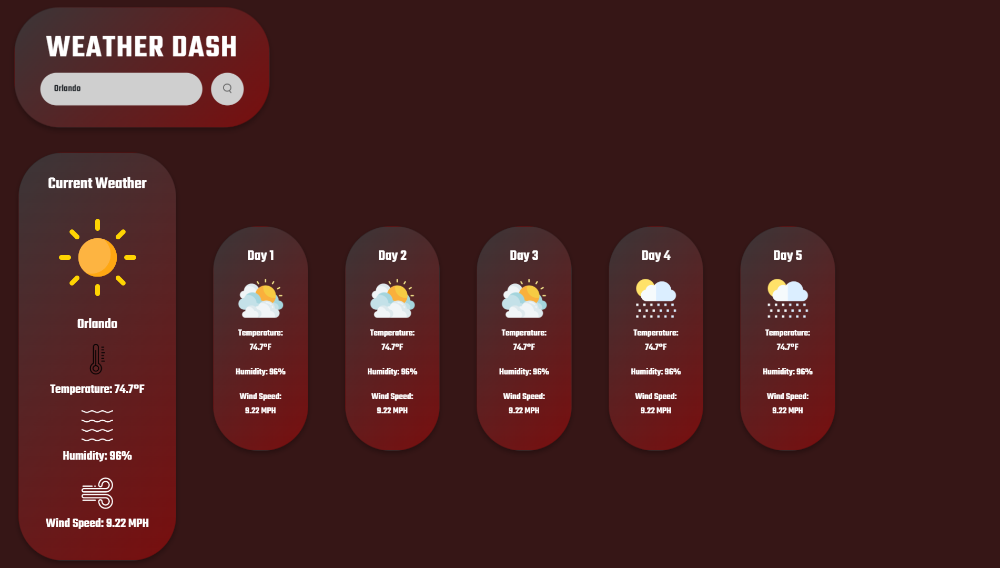

# Weather App

## Description
This is a weather app that uses the OpenWeather API to display the current weather and a 5-day forecast for a city that the user searches for. The app also saves the user's search history and allows them to click on a city to see the weather for that city again.
## Preview

## Table of Contents
- [Installation](#installation)
- [Usage](#usage)
- [License](#license)
- [Contributing](#contributing)
- [Tests](#tests)
- [Questions](#questions)
## Installation
To Run Locally:
1. Clone the repository
2. Open the index.html file in your browser
## Usage
To use the app, simply type the name of a city into the search bar and click the search button. The current weather and 5-day forecast for that city will be displayed. The city will also be added to the search history. To see the weather for a city in the search history, simply click on the city name.
## License
    This project is licensed under the MIT license.
## Contributing
For student use only.
## Tests
No tests are included in this project.
## Questions
If you have any questions, please contact me at harrisonminer59@gmail.com or visit my GitHub page at https://github.com/DrBubblez.
